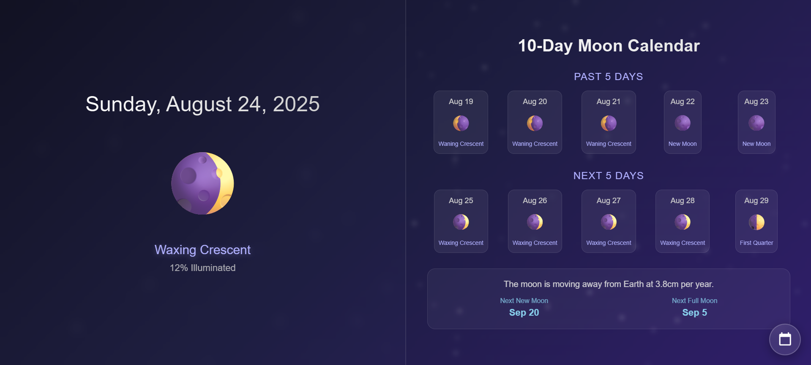

# 🌙 Lunar Calendar - Interactive Moon Phase Tracker

A beautiful, interactive web application that displays real-time moon phases with accurate astronomical calculations. Track the lunar cycle with an elegant split-screen design featuring today's moon phase and a comprehensive 10-day forecast.

## ✨ Features

### 🌓 Core Functionality
- **Real-time Moon Phases** - Accurate lunar calculations for any date
- **Interactive 10-Day Forecast** - View 5 days past and 5 days future moon phases
- **Date Picker** - Jump to any specific date to view historical or future moon phases
- **Phase Details** - Displays moon phase names and illumination percentages

### 🎨 Design & UX
- **Split-screen Layout** - Clean division between current and forecast views
- **Glassmorphism UI** - Modern transparent design with backdrop blur effects
- **Animated Stars Background** - Twinkling stars create an immersive night sky
- **Responsive Design** - Works seamlessly on desktop, tablet, and mobile devices
- **Smooth Animations** - Elegant hover effects and transitions

### 📊 Additional Information
- **Educational Moon Facts** - Random lunar facts displayed with each interaction
- **Next Phase Predictions** - Shows dates for upcoming new and full moons
- **Today Highlight** - Current date is visually emphasized in the forecast
- **Intuitive Navigation** - Click any forecast day to view detailed information

## 🚀 Live Demo

[View Live Demo](your-github-pages-url-here) *(Replace with your GitHub Pages URL)*

## 📱 Screenshots

### Desktop View

### Mobile View  
*Add screenshot of mobile version*

---

⭐ **Star this repository if you find it helpful!** ⭐

*Built with 🌙 and ❤️ for astronomy enthusiasts*